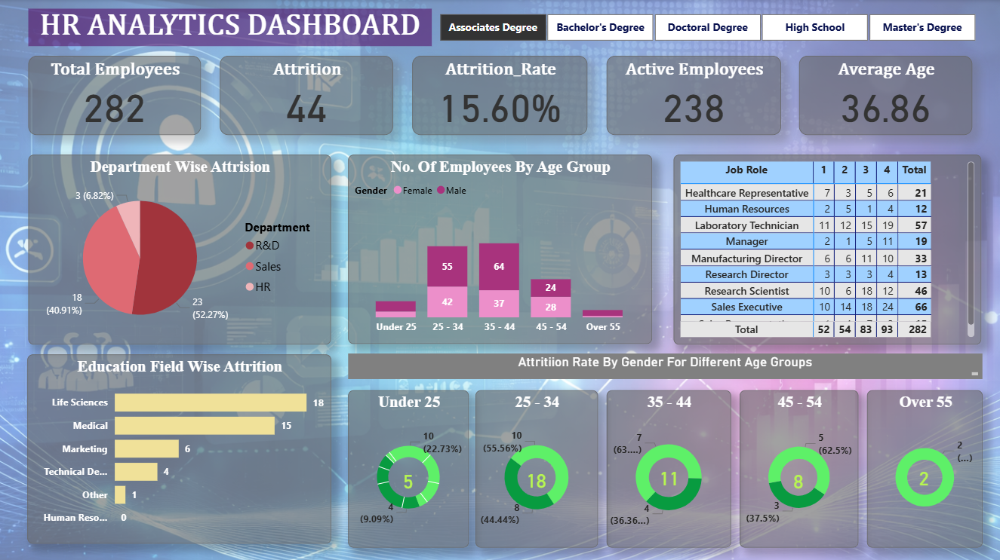
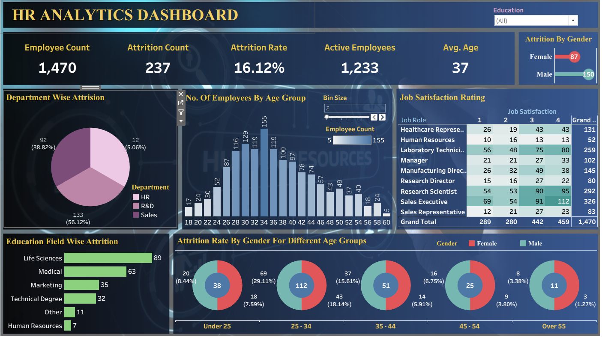
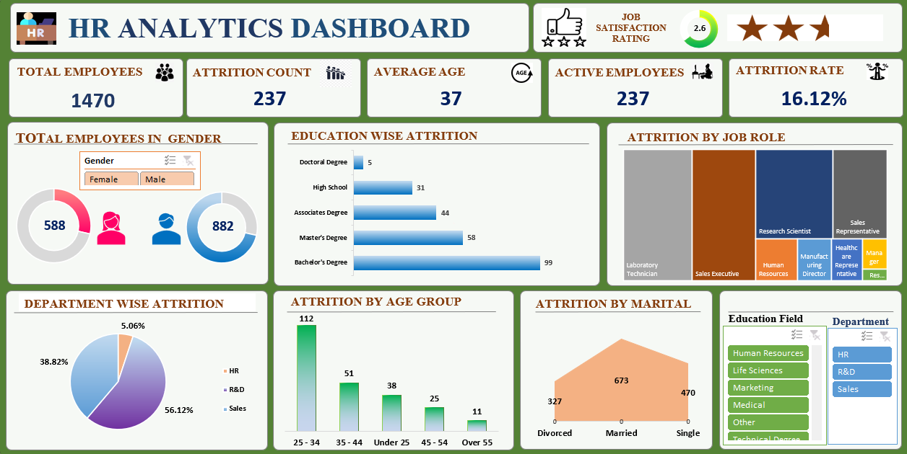

# 📊 HR Analytics Dashboard

## 📌 Project Overview

The **HR Analytics Dashboard** is a data-driven analytics project developed to analyze employee attrition, workforce distribution, job satisfaction, and overall HR performance metrics.

This project demonstrates the practical implementation of:

- Microsoft Excel
- SQL
- Power BI
- Tableau

for data cleaning, transformation, analysis, and interactive dashboard visualization.

The primary objective of this project is to identify workforce trends and generate actionable insights that support HR decision-making and employee retention strategies.

---

# 🚀 Tools & Technologies Used

- **Microsoft Excel** → Data Cleaning & Preprocessing
- **SQL** → Database Creation & Analytical Queries
- **Power BI** → Interactive Dashboard & KPI Visualization
- **Tableau** → Advanced Visual Analytics & Data Storytelling

---

# 📈 Key Dashboard Features

- Employee Attrition Analysis
- Department-wise Workforce Distribution
- Gender Diversity Insights
- Job Satisfaction Analysis
- Education & Age Group Analysis
- Active Employee Tracking
- Business Travel Impact on Attrition
- Interactive Filters & KPI Cards
- Dynamic Reports & Trend Visualization

---

# 📊 Business Insights Generated

- Identified departments with the highest attrition rates
- Analyzed employee satisfaction across different job roles
- Examined workforce distribution based on education and age groups
- Compared active employee trends with attrition patterns
- Generated HR insights for workforce planning and decision-making

---

# 🗂️ Dataset Information

The dataset contains HR-related employee information including:

- Employee ID
- Gender
- Marital Status
- Department
- Education
- Job Role
- Job Satisfaction
- Business Travel
- Attrition Status
- Active Employee Details

---

# 🧠 SQL Implementation

SQL was used for:

- Database schema creation
- Employee data management
- Analytical querying
- Dashboard reporting support

## Sample SQL Query

```sql
CREATE TABLE hrdata (
    emp_no INT PRIMARY KEY,
    gender VARCHAR(50) NOT NULL,
    marital_status VARCHAR(50),
    age_band VARCHAR(50),
    age INT,
    department VARCHAR(50),
    education VARCHAR(50),
    education_field VARCHAR(50),
    job_role VARCHAR(50),
    business_travel VARCHAR(50),
    employee_count INT,
    attrition VARCHAR(50),
    attrition_label VARCHAR(50),
    job_satisfaction INT,
    active_employee INT
);
```

---

# 📌 Dashboard Objectives

- Monitor employee performance and retention trends
- Improve HR decision-making through data visualization
- Analyze workforce demographics and employee engagement
- Demonstrate multi-tool dashboard development capabilities

---

## 📈 Power BI Dashboard



## 📊 Tableau Dashboard



## 📑 Excel Dashboard



# 💡 Project Highlights

✔ Developed dashboards using both **Power BI** and **Tableau**

✔ Utilized **Excel** for data preprocessing and transformation

✔ Performed **SQL-based analysis** for insight extraction

✔ Designed interactive dashboards with KPI indicators and filters

✔ Demonstrated flexibility across multiple BI and analytics tools

---

# 📁 Project Structure

```bash
HR-Analytics-Dashboard/
│
├── Dataset/
├── SQL Queries/
├── Excel Files/
├── Power BI Dashboard/
├── Tableau Dashboard/
├── Dashboard Screenshots/
└── README.m
